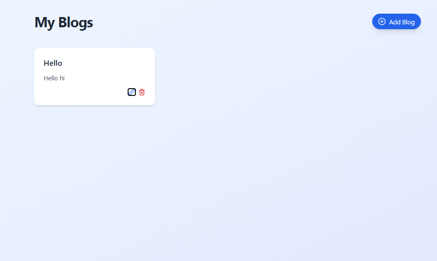

# Blog Web Page

This is a simple blog web page built with React and Tailwind CSS.

The web page is responsive and works on all devices.

The web page allows the user to add, edit, and delete blog posts.

The web page uses local storage to store the data.

The web page is built using Vite.
