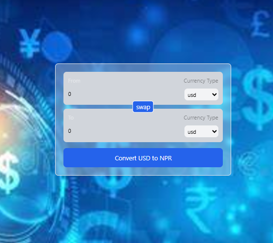

# Currency Converter

This is a simple currency converter made with React.

## Features

- Convert amount of money from one currency to another
- Get current exchange rate

## How to use

- Clone the repository
- Run `npm install` to install dependencies
- Run `npm start` to start the application
- Open your browser and go to `http://localhost:3000` to use the application

## Technologies used

- React
- React Hooks
- CSS

## Contributing

Contributions are welcome. You can contribute by:

- Reporting bugs
- Suggesting new features
- Writing code

